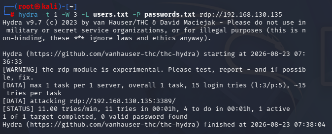
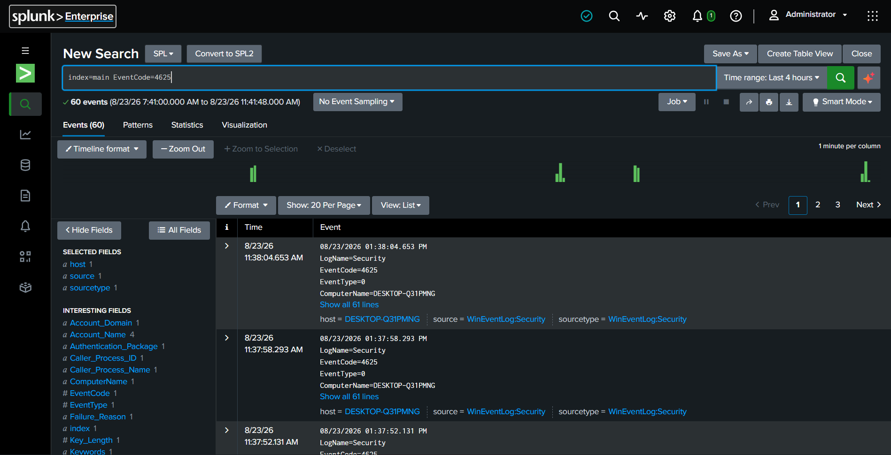
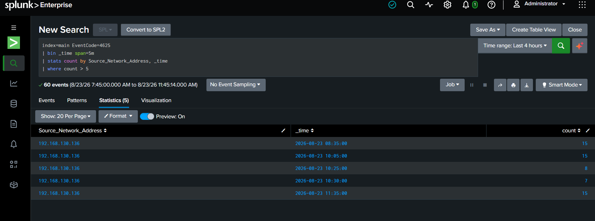
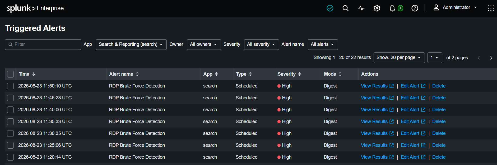

# Incident Investigation Report — RDP Brute Force Attack

**Report ID:** IR-2026-0823-001
**Analyst:** Vinay Chowdary
**Date of Investigation:** 2026-08-23
**Environment:** SOC Home Lab (Kali attacker, Windows 11 target, Splunk SIEM)

---

## 1. Alert

**Alert Name:** RDP Brute Force Detection
**Severity (system-assigned):** High
**Alert Type:** Scheduled correlation search
**First Triggered:** 2026-08-23 11:20:14 UTC
**Detection Logic:**

```spl
index=main EventCode=4625
| bin _time span=5m
| stats count by Source_Network_Address, _time
| where count > 5
```

The alert fires when more than 5 failed logon events (EventCode 4625) are observed from the same source address within a 5-minute window. Over the course of the lab session, the alert fired **22 times**, confirming the detection logic is stable and repeatable rather than a one-off false positive.

---

## 2. Context

- **Target host:** DESKTOP-Q31PMNG (Windows 11 lab machine)
- **Service targeted:** RDP (port 3389)
- **Log source:** Windows Security Event Log (`WinEventLog:Security`), ingested into Splunk under `index=main`
- **Observed source of failed logons:** `192.168.130.136`
- **Total related events in the 4-hour search window:** 60 events, all `EventCode=4625` (failed logon), `EventType=0`

This activity was generated intentionally as part of a controlled lab exercise using Hydra from a Kali Linux attacker box, to validate whether the SIEM could detect and alert on brute-force authentication attempts against RDP.

---

## 3. Evidence

**Attack tooling (attacker-side):**

```
hydra -t 1 -W 3 -L users.txt -P passwords.txt rdp://192.168.130.135
```

- Hydra v9.7, RDP module (marked experimental by the tool itself)
- 1 task per server, 15 total login attempts (3 usernames × 5 passwords)
- Attack window: 07:36:33 → 07:38:04 (approx. 1 minute 31 seconds)
- Result reported by Hydra: **0 valid passwords found** — i.e., the brute-force attempt failed to gain access, but generated the expected volume of failed-logon telemetry.


*Figure 1: Hydra launched against 192.168.130.135:3389 using a small username/password wordlist.*

**SIEM-side raw events (Splunk):**

- Query: `index=main EventCode=4625`
- 60 matching events over a 4-hour window (08/23/26 07:41 AM – 11:41 AM)
- Each event confirmed: `LogName=Security`, `EventCode=4625`, `ComputerName=DESKTOP-Q31PMNG`


*Figure 2: 60 EventCode 4625 (failed logon) events ingested into Splunk over the 4-hour observation window.*

**Correlation results (detection query):**

| Source_Network_Address | Time              | Count |
|------------------------|--------------------|-------|
| 192.168.130.136         | 2026-08-23 08:35:00 | 15    |
| 192.168.130.136         | 2026-08-23 10:05:00 | 15    |
| 192.168.130.136         | 2026-08-23 10:25:00 | 8     |
| 192.168.130.136         | 2026-08-23 10:30:00 | 7     |
| 192.168.130.136         | 2026-08-23 11:35:00 | 15    |

All five 5-minute windows exceeded the `count > 5` threshold, each correctly triggering the alert.


*Figure 3: SPL correlation search grouping failed logons into 5-minute windows and filtering for count > 5.*

**Triggered alerts (sample from Splunk "Triggered Alerts" view):**

- 22 total triggered instances of "RDP Brute Force Detection," all rated **High** severity, all of type **Scheduled**, generated consistently every ~5 minutes while attack traffic was present — showing the alert did not require manual re-triggering and behaved as a stable, recurring detection.


*Figure 4: 22 total triggered instances of the RDP Brute Force Detection alert, all High severity.*

---

## 4. Analysis

- The volume and timing pattern (multiple failed logons from a single source, clustered tightly in time, well above normal user error rates) is consistent with an automated credential brute-force attempt rather than legitimate user mistyping.
- The attack did **not** succeed in authenticating (0 valid passwords found by Hydra), meaning this incident represents a **failed intrusion attempt**, not a confirmed compromise.
- The detection correctly identified all 5 windows where the attack volume crossed the threshold, with no evidence of missed detection windows in the reviewed period.
- **Note on data:** the source IP address captured as the origin of the failed logons in Splunk (`192.168.130.136`) differs from the RDP target address used in the Hydra command (`192.168.130.135`). In a real investigation, this discrepancy would be flagged and resolved by confirming interface/NAT configuration on the lab network before closing the case, since accurate source attribution is critical to any real response action (e.g., blocking).

---

## 5. Severity

**Assigned Severity: High** (matches system-assigned severity)

Justification:
- Directly targets a remote access service (RDP), which if successfully compromised would grant full interactive access to the host.
- Sustained, repeated attempts (22 triggered alerts) indicate a persistent attacker, not a single mistake.
- No successful authentication occurred, which would otherwise escalate this to Critical/confirmed-compromise status.

---

## 6. Decision

- **Disposition:** True Positive — confirmed brute-force attempt, unsuccessful.
- **Immediate action (in a live environment):** Block source IP at the firewall/NSG level; disable or rate-limit RDP exposure to the internet if applicable.
- **Escalation:** Would escalate to Tier 2 only if repeated attempts continued after blocking, or if any successful authentication (EventCode 4624 immediately following a 4625 cluster) was observed from the same source.
- **Verification step:** Confirm no successful logon (`EventCode=4624`) occurred from `192.168.130.136` in the same time window (recommended as a follow-up query: `index=main EventCode=4624 Source_Network_Address=192.168.130.136`).

---

## 7. Documentation / Recommendations

- **Detection tuning:** Current threshold (`count > 5` per 5-minute window) worked well for this test but should be validated against real user behavior baselines to reduce false-positive risk (e.g., a user with a forgotten password could plausibly hit 5+ failures).
- **Recommended enhancement:** Add a correlation rule that also checks for a successful login (4624) shortly after a failed-logon burst from the same source — this would indicate a *successful* brute force and should be rated Critical, not High.
- **Recommended control:** Enable account lockout policy and/or RDP connection rate-limiting at the network level to reduce the attack surface regardless of detection.
- **Follow-up:** Resolve the IP discrepancy noted in Section 4 before considering this fully closed in a production setting.

---

*This report was generated as part of a personal SOC home lab project for skill demonstration purposes. Environment used private, non-routable IP ranges (192.168.130.0/24) with no real-world targets.*
